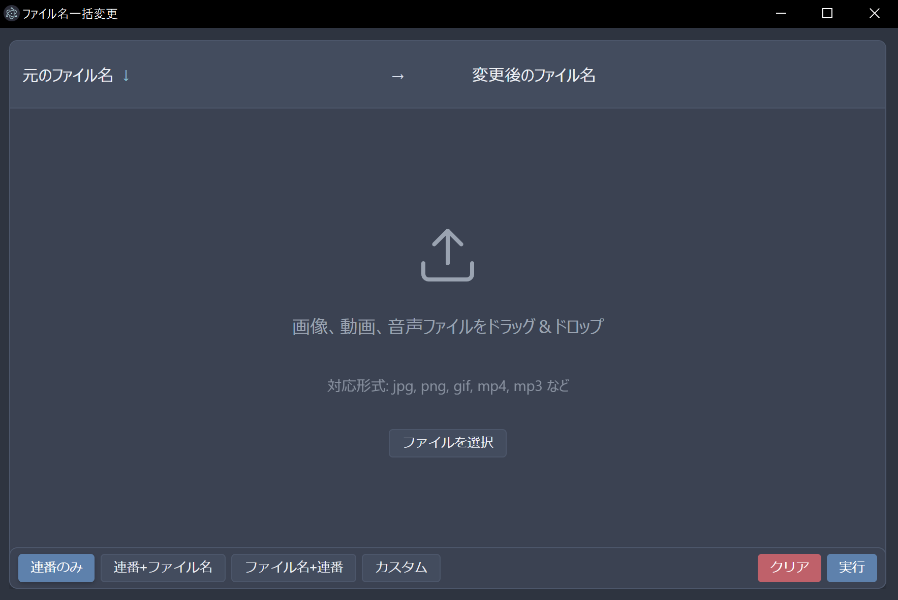

# ファイル名一括変更 (Multi File Rename)

画像、動画、音声ファイルを簡単に一括リネームできるモダンなデスクトップアプリケーションです。ドラッグ＆ドロップで簡単にファイルを追加し、カスタマイズ可能なテンプレートで名前を変更できます。



## 主な機能

- ドラッグ＆ドロップまたはファイル選択ダイアログでファイルを追加
- 名前変更前にプレビューで確認可能
- 複数のリネームモード：
  - 連番のみ（1.jpg, 2.jpg など）
  - 連番+ファイル名（1_filename.jpg, 2_filename.jpg）
  - ファイル名+連番（filename_1.jpg, filename_2.jpg）
  - カスタムテンプレート（自由な形式で設定可能）
- 柔軟なテンプレート設定：
  - `{filename}` - 元のファイル名（拡張子なし）
  - `{num}` または `{num:03d}` - 連番（例: 1 または 001）
  - `{date}` または `{date:%Y-%m-%d}` - 日付（オプショナルフォーマット）
- 元のファイル名または変換後のファイル名でソート
- Shift/Ctrlキーを使った複数ファイル選択
- 選択したファイルをリストから削除（Deleteキー）
- 画像、動画、音声ファイル形式をサポート
- 大量ファイル処理時の進捗表示
- シンプルで使いやすいインターフェース

## 対応ファイル形式

- 画像: jpg, jpeg, png, gif, bmp, tga, tif, tiff, psd, webp, svg
- 動画: mp4, mov, avi, mkv, webm, wmv, flv, f4v, m4v
- 音声: ogg, mp3, wav

## 使い方

1. アプリケーションを起動します
2. 画面中央のドロップエリアにファイルをドラッグ＆ドロップするか、「ファイルを選択」ボタンをクリックしてファイルを追加します
3. 下部のモードボタンからリネーム方法を選択します
   - 「連番のみ」：単純な連番でリネーム（1.jpg, 2.jpg など）
   - 「連番+ファイル名」：連番を先頭に付加（1_filename.jpg など）
   - 「ファイル名+連番」：ファイル名の後に連番を付加（filename_1.jpg など）
   - 「カスタム」：テンプレートを自由に設定
4. カスタムモードを選択した場合は、テンプレートと開始番号を設定できます
5. プレビューでリネーム結果を確認します
6. 「実行」ボタンをクリックしてファイル名を一括変更します

## インストール方法

### リリースからのダウンロード

1. [Releasesページ](https://github.com/uhiyamind/multi-file-rename/releases)から最新のリリースをダウンロード
2. ポータブル実行ファイルを実行（インストール不要）

### ソースからのビルド

1. リポジトリをクローン
   ```
   git clone https://github.com/uhiyamind/multi-file-rename.git
   cd multi-file-rename
   ```

2. 依存関係をインストール
   ```
   npm install
   ```

3. アプリケーションの実行
   ```
   npm start
   ```

4. 配布用ビルド
   ```
   npm run dist
   ```

## 開発者向け情報

- `npm start` - アプリケーションを起動
- `npm run dev` - 開発モードでアプリケーションを起動
- `npm run pack` - インストーラーを作成せずにアプリケーションをパッケージ化
- `npm run dist` - 配布可能なパッケージを作成

## 技術スタック

- Electron
- JavaScript
- HTML/CSS
- Nord テーマ（カラースキーム）

## ライセンス

MIT
